# X-Road Standalone Security Server Tutorial
The instructions in this document assume you have MacOS.  They should work similarly for the Windows and Linux operating 
systems respectively.

In this example we will do the following


1. Launch a simple web service on our laptop
2. Launch the X-Road Standalone Security Server and configure it for our Web Service
3. Launch curl to test the web service through x-road
4. Launch a simple command line client to connect to the web service through x-road
5. Launch a rich web client to connect to the web service through x-road


## Setting up your environment

### Install Firefox.  
Firefox is recommened for this tutorial as it is easier to work with self signed certificates than on 
Safari.  Please download firefox here:  <https://www.mozilla.org/en-US/firefox/new/>

### Install Docker
Please Install Docker Desktop.  The x-road security server requies docker.   
 Go to <https://www.docker.com/get-started>
and click "Download Desktop and Take a Tutorial".  You will be required to create a free account during the download process.


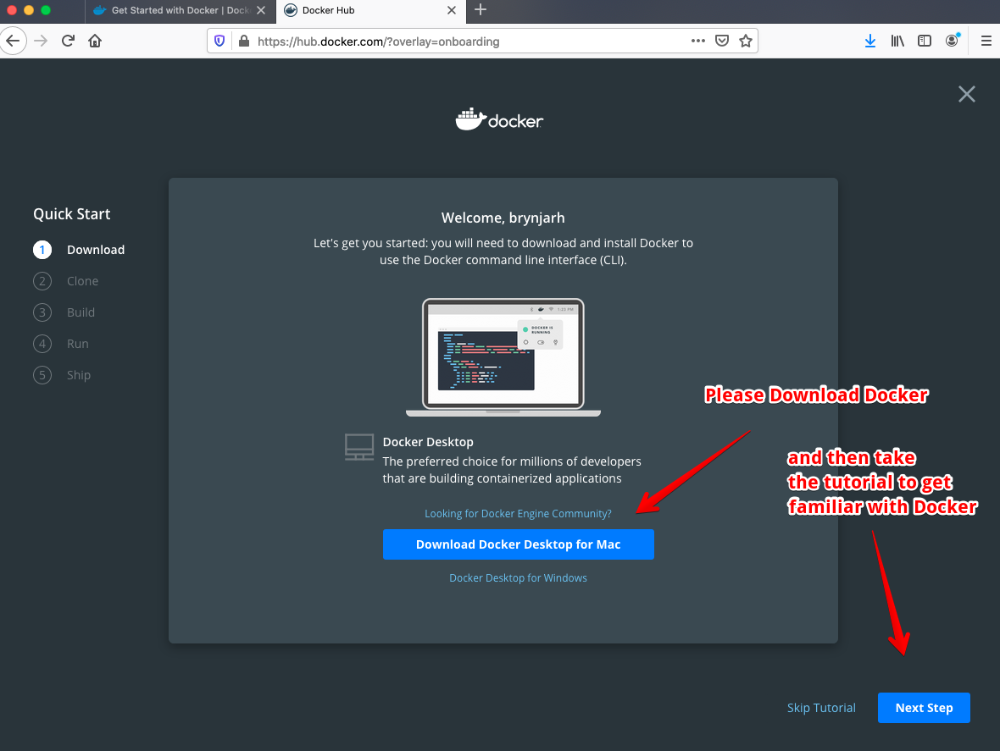

### Install Go
Please visit <https://golang.org/dl/> and download Go for your operating system.  Mac users can also use the brew command
to install go.  

```console
$ brew install golang
```

### Install Git
For Mac users I recommend just typing ```git``` on the command line.  This should launch the installation of the X-Code 
command line tools.   When the installation finishes you can confirm that git is installed by typing git at the command
prompt.

Windows users can download git from <https://git-scm.com/downloads>


## Testing out the web service

Our first step will be launching a simple web service we will be using througout this exercise. Please open a new terminal
window, make a new folder called test and clone the git repository for the test server into the new folder.


```console
$ mkdir test
$ cd test
$ git clone https://github.com/digitaliceland/xrd-rest-server.git
```

Now you should have downloaded the source code for the rest test webservice.   Please feel free to open the folder and look around.

Next we would like to compile the web service:

```console
$ cd xrd-rest-server
$ go build main.go
```
Now we should have a new file called main ( main.exe on windows )

Please rename the file to something more appropriate like "server"

```console
$ mv main rest-server
```

Now we can execute the new application we made and we see that it has started on port 1234

```console
$ ./rest-server
INFO	2020/02/27 15:03:57 Starting server on :1234
```

Good job.  Now we have a running web service.  Please open your Firefox browser and open this URL:
<http://localhost:1234>  You should see a simple OK message showing that the server is working.

The server has two webswevices, time and ping respectively.  These take no parameters so you can just visit their URL to test them out

<http://localhost:1234/ping> and <http://localhost:1234/time>

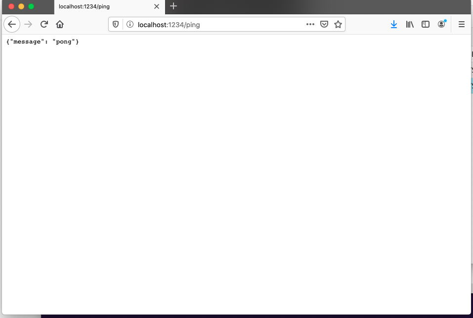


Try out the web service by refreshing the page several time and see the time being updated!

## Setting up the X-Road Standalone Secutity Server (SSS)
### Starting and stopping the server
Leaving the web service active, please open a new command prompt and issue this commmand:

```console
docker run -p 4000:4000 -p 80:80 --name ss niis/xroad-security-server-standalone:bionic-6.21.0
```

This will launch the SSS on ports 4000 and 80.  port 4000 has an admin interface we will use, but port 80 will be used to 
connect to services.  

Tip:
When you finish using the security server you can just press CTRL-C to shut it down.  When you want to restart it please use ```docker start -ai ss```

### Configuring the server
Leaving the SSS running, please point your Firefox browser to: https://localhost:4000/login

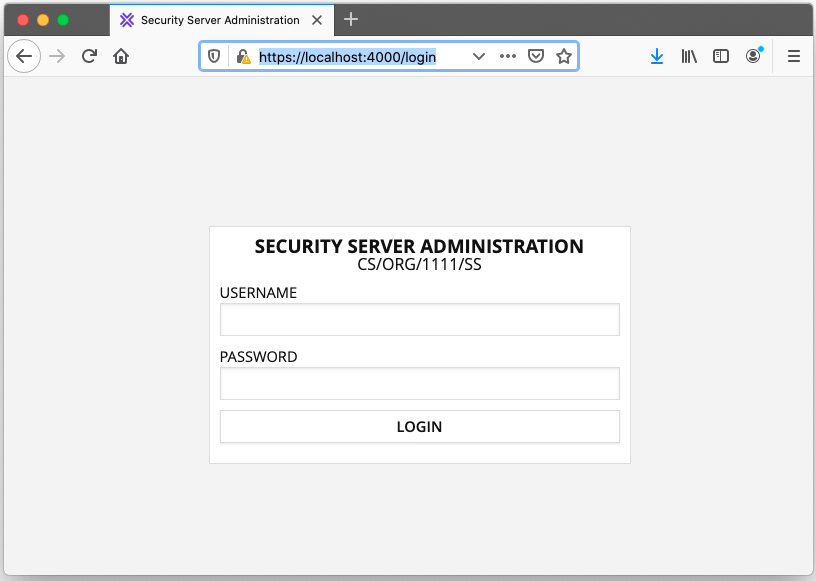

Please use the following credentials to log in:
* Username: xrd
* Password: secret

Now you shoul be greeted by the X-Road SS page.  

Out of the box there is already configured a TestClient and a TestService.  We will use these accounts for our tests.

Next we need to set up our new web service, to make it 
accessible to our clients.

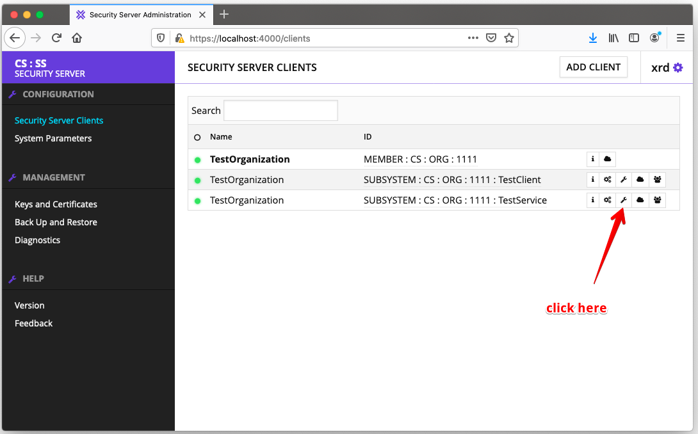

Click the spanner to add a new REST web service and fill out the form.  Please note that you will need your network IP address on your local networok

To get this IP address please click the apple -> System Preferences -> Network.  You will find your IP address there
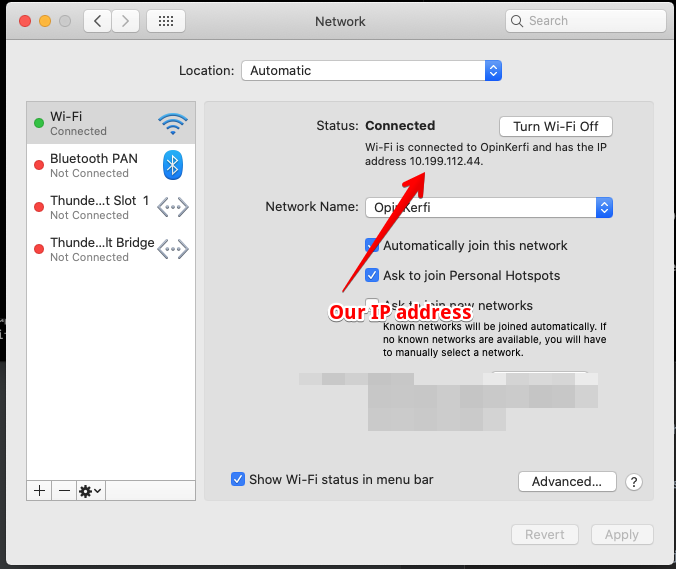

Now that you have your IP address you are ready to add the new web service.

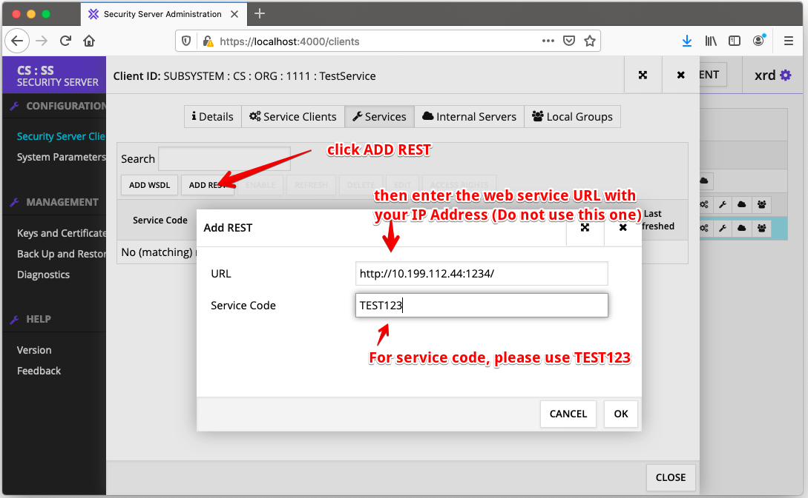

Next we need to enable the web service

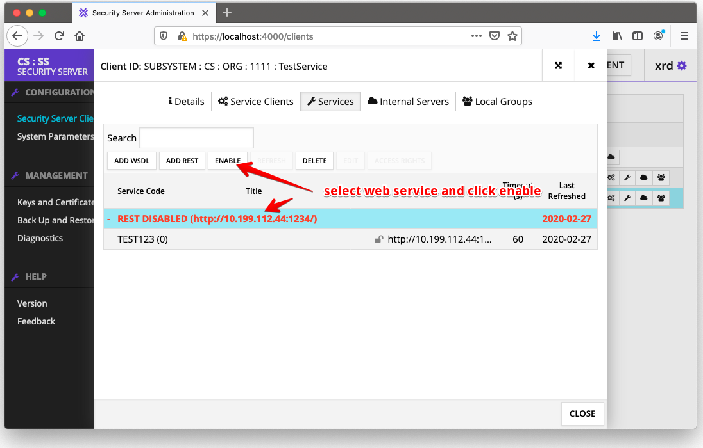

So far nobody has access to this web service.  We will grant access to the build inn TestClient
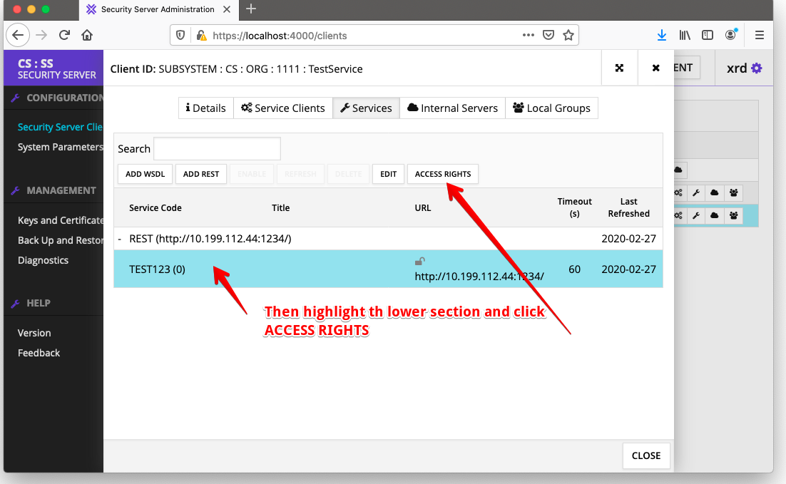

And please select Add Subjects

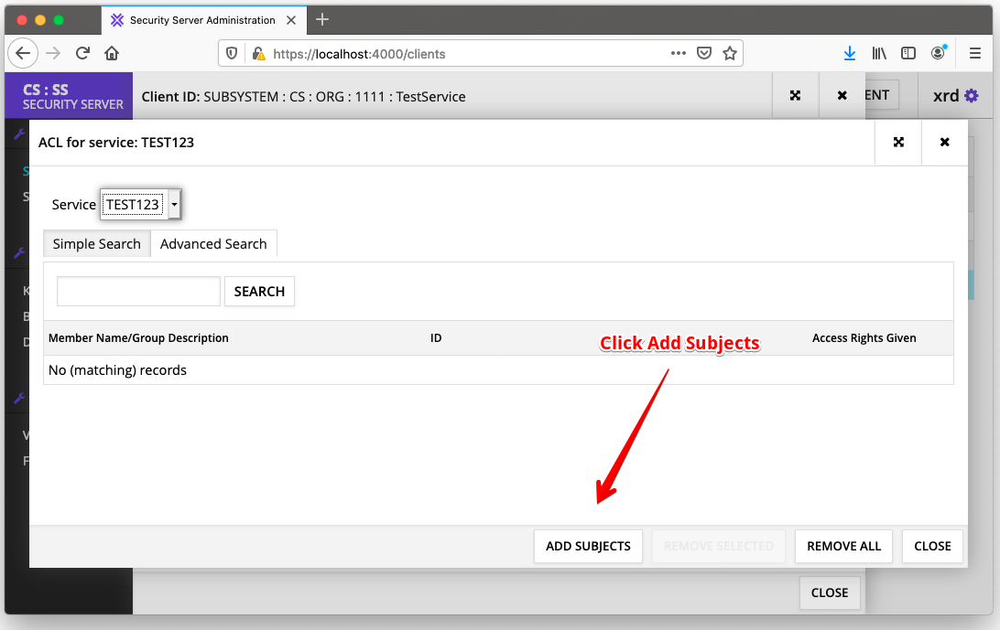

This brings us to the Add Subjects dialog box.  We want to add TestClient to our ACL

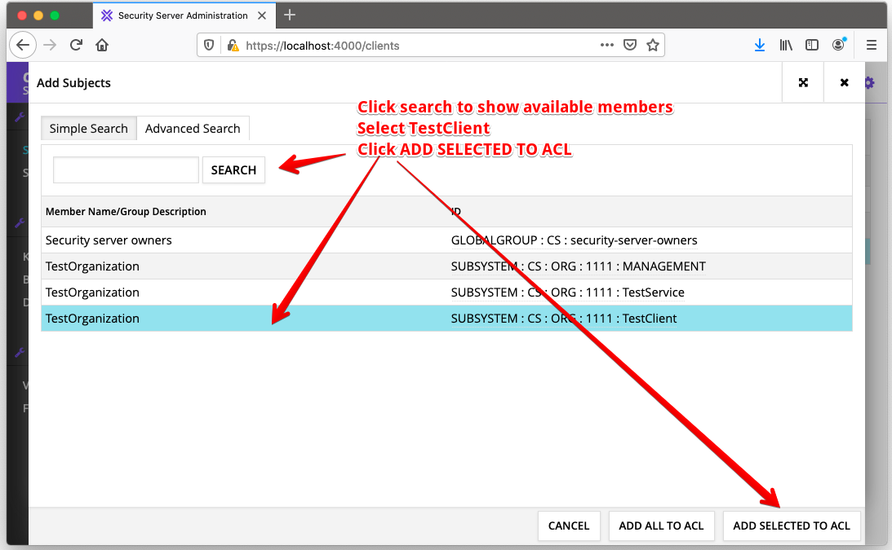

Nice Work.  We now have set up our ACLs.  Please close these dialog boxes so we can start working!

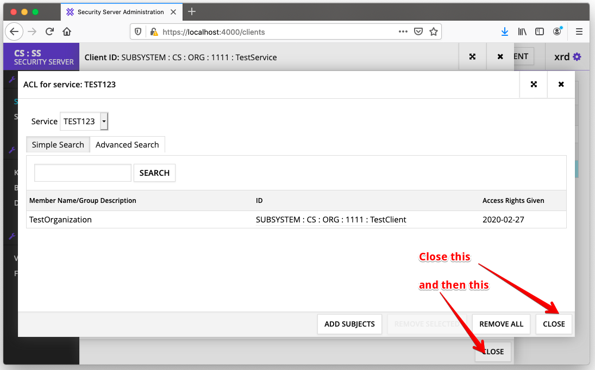

## Testing the REST client

Here we will use a simple command line utility to connect to the REST web service we started earlier via our new Security Server.

We start by downloading the source code from git

```console
$ mkdir test
$ cd test
$ git clone https://github.com/digitaliceland/xrd-rest-client.git
```

Now you should have downloaded the source code for the client.   Please feel free to open the folder and look around.

Next we would like to compile the web service:

```console
$ cd xrd-rest-client
$ go build main.go
```
Now we should have a new file called main ( main.exe on windows )

Please rename the file to something more appropriate like "rest-client"

```console
$ mv main rest-client
```

Now we can execute the new application we made and explore the options available.

```console
$ ./rest-client
No command specified
Usage of ./rest-client:
  -client string
    	Your X Road Client ID (default "CS/ORG/1111/TestClient")
  -cmd string
    	method to call on your REST server
  -loop
    	repeatedly call the function every second
  -service string
    	Your X Road Service ID (default "CS/ORG/1111/TestService/TEST123")
  -ss string
    	Your X Road Security Server URL without trailing / (default "http://localhost:80")
```

And now its time to connect to the web service.  We will start by connecting to the ping service

```console
$ ./rest-client -cmd ping -service CS/ORG/1111/TestService/TEST123 -client CS/ORG/1111/TestClient -ss http://localhost:80
Accessing:  http://localhost:80/r1/CS/ORG/1111/TestService/TEST123/ping
Ping returned:  {"message": "pong"}
```

And we successfully received a reply from the web service.  Note that port 80 is the service port for the security server
as we configured when we started it through docker.  The service and client paths are the configuration options
we specified when we set up the service via X-Road security server.

Nice job.  Now we will make an additional test using the time service and the loop parameter:

```console
./rest-client -cmd time -loop -service CS/ORG/1111/TestService/TEST123 -client CS/ORG/1111/TestClient -ss http://localhost:80
Accessing:  http://localhost:80/r1/CS/ORG/1111/TestService/TEST123/time
Time returned:  {"time": "2020-02-28T13:47:37Z"}
Accessing:  http://localhost:80/r1/CS/ORG/1111/TestService/TEST123/time
Time returned:  {"time": "2020-02-28T13:47:38Z"}
Accessing:  http://localhost:80/r1/CS/ORG/1111/TestService/TEST123/time
Time returned:  {"time": "2020-02-28T13:47:39Z"}
Accessing:  http://localhost:80/r1/CS/ORG/1111/TestService/TEST123/time
```

When you are satisfied with your test you can terminate this via CTRL-C.

Also if you switch back to the window with the REST server running you will see several log lines from when the security server
is connecting to the web service

```console
INFO	2020/02/28 13:45:08 10.199.112.44:61614 - HTTP/1.1 GET /ping
INFO	2020/02/28 13:47:37 10.199.112.44:61627 - HTTP/1.1 GET /time
INFO	2020/02/28 13:47:37 10.199.112.44:61627 - HTTP/1.1 GET /time
INFO	2020/02/28 13:47:38 10.199.112.44:61628 - HTTP/1.1 GET /time
INFO	2020/02/28 13:47:38 10.199.112.44:61628 - HTTP/1.1 GET /time
```

Feel free to check the source code for the client for inspiration on how to access web services via x-road, since it 
provides a simple example on how this can be achieved. 


## Testing the full Web based client - xclient

As before we start by downloading the source code from github:

```console
$ git clone https://github.com/digitaliceland/xrd-xclient.git
```
Next we would like to compile the client:

```console
$ cd xrd-xclient
$ go build main.go
```
Now we should have a new file called main ( main.exe on windows )

Please rename the file to something more appropriate like "xclient"

```console
$ mv main xclient
```

and now execute the client:

```console
$ ./xclient run
```

### Time Test

Now point your browser to <http://127.0.0.1:5000>

You should be greeted with this page here:
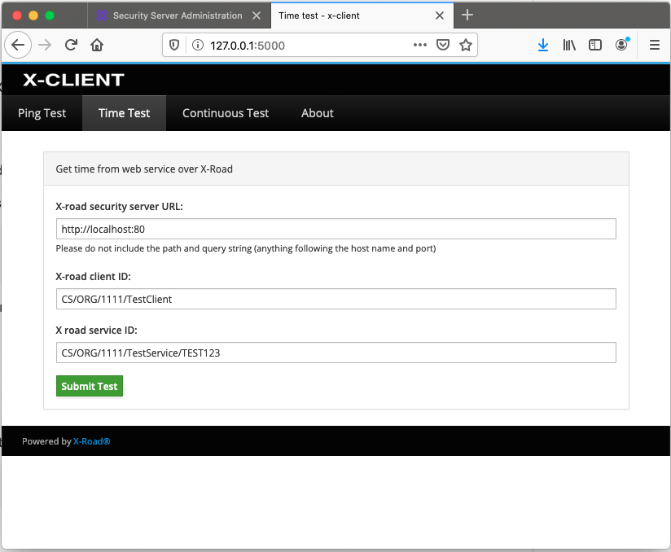

Conveniently the default client ID and service ID are the same ones we used during our configuration of the X-Road
Security Server.

Please click "Submit Test".  Then you should see a screen similar to this one:
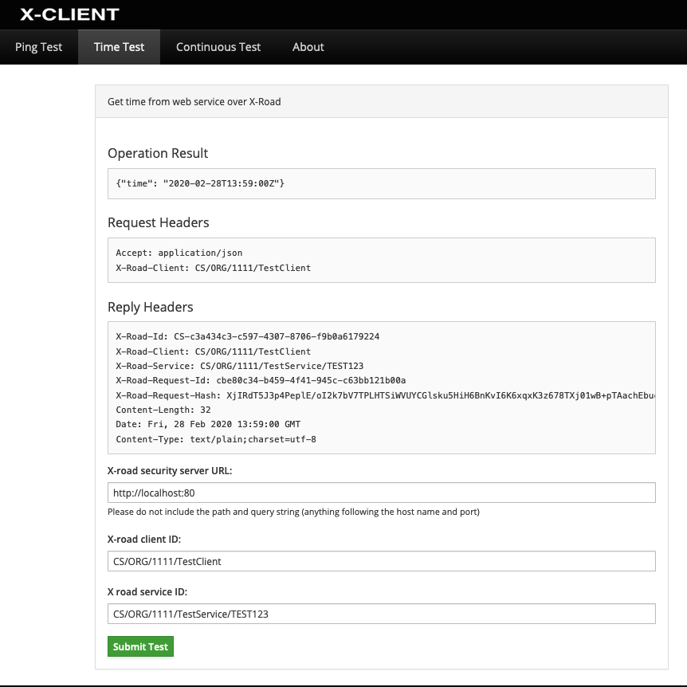

As you an see we were able to retrieve the time from the web service.  Also we can see all the request headers that xclient
sent to the X-Road Security Server, and the reply headers we received back from the security server.

### Continuous Test
Please click the "Continous test" tab and then the "start" button.   This will launch one request per second to the security server
and return the replies, one per line.

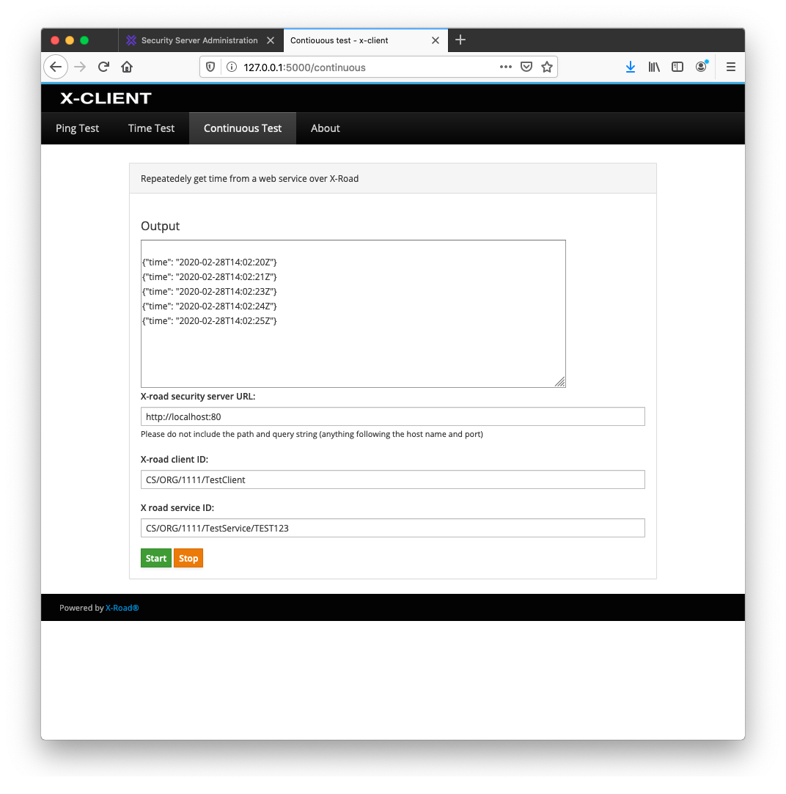

This concludes this tutorial.  Good luck in your X-Road related project!


